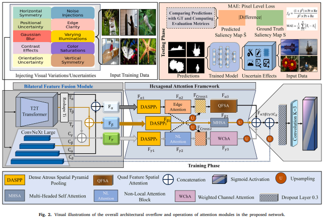
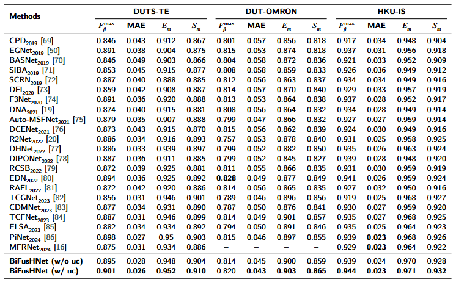
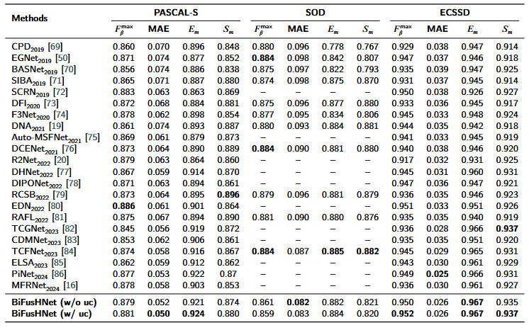
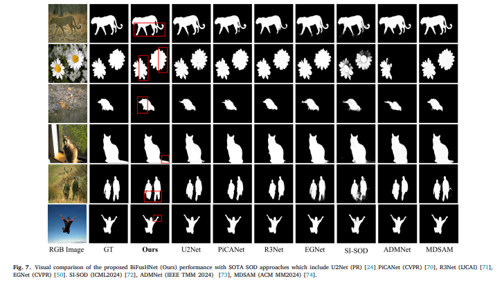

# BiFusHNet

**BiFusHNet: Bilateral Feature Fusion with Hexagonal Attention for Robust Saliency Detection under Uncertain Environments**

This repository is reserved for the official implementation of the proposed **BiFusHNet** framework.  

> 🔧 **Note:** The code is currently undergoing an organization process and will be made available to the research community soon. Stay tuned for updates.

---

## 📋 Table of Contents
- [Introduction](#introduction)
- [Method Overview](#method-overview)
- [Network Architecture](#network-architecture)
- [Datasets](#datasets)
- [Installation](#installation)
- [Usage](#usage)
- [Saliency Predictions](#saliency-predictions)
- [Results](#results)
- [Availability](#availability)
- [Citation](#citation)
- [License](#license)
- [Contact](#contact)

---

## 📌 Introduction

Saliency detection plays a foundational role in many vision tasks such as segmentation, object detection, and image captioning. In this work, we propose **BiFusHNet**, a novel saliency detection network designed to perform robustly under **visual uncertainties** and **dynamic environments**.

The framework addresses challenges like:
- Preserving fine object boundaries
- Handling noisy inputs and visual ambiguities
- Maintaining high performance across diverse real-world scenarios

---

## 🔍 Method Overview

BiFusHNet leverages bilateral feature fusion and a novel hexagonal attention mechanism to enhance discriminative feature representation. The architecture is tailored to preserve fine object boundaries while maintaining robustness to noise and visual ambiguities.

Key contributions include:
- **Bilateral Feature Fusion**: Effectively integrates low-level and high-level features
- **Hexagonal Attention Mechanism**: Captures contextual information with geometric precision
- **Uncertainty Modeling**: Explicitly handles visual uncertainties for more robust predictions

> Full architectural details, along with module breakdowns and additional ablation studies, will be available soon.

---

## 🔄 Network Architecture
Visual Illustration of the proposed network.





## 📂 Datasets

BiFusHNet is trained and evaluated on several widely used saliency detection benchmarks. Below are the links to download each dataset:

- [DUTS](http://saliencydetection.net/duts/)  
- [DUT-OMRON](http://saliencydetection.net/dut-omron/)  
- [HKU-IS](https://i.cs.hku.hk/~gbli/deep_saliency.html)  
- [PASCAL-S](https://www.yanweifu.com/cvpr2014/)  
- [SOD](http://elderlab.yorku.ca/SOD/)  
- [ECSSD](https://www.cse.cuhk.edu.hk/leojia/projects/hsaliency/)  

Please organize the datasets in the following directory structure:

```
datasets/
├── Training/
│   └── DUTS-TR/
│       ├── images/
│       └── masks/
└── Evaluation/
    ├── DUTS-TE/
    │   ├── images/
    │   └── masks/
    ├── HKU-IS/
    │   ├── images/
    │   └── masks/
    ├── DUT-OMRON/
    │   ├── images/
    │   └── masks/
    ├── PASCAL-S/
    │   ├── images/
    │   └── masks/
    ├── SOD/
    │   ├── images/
    │   └── masks/
    └── ECSSD/
        ├── images/
        └── masks/
```

---

## 🛠️ Installation

```bash
# Clone the repository
git clone https://github.com/username/BiFusHNet.git
cd BiFusHNet

# Create conda environment
Coming soon
# Install PyTorch with CUDA support
Coming soon
# Install additional dependencies
Coming soon

## 🚀 Usage

##Training
Coming soon
## Evaluation
Coming soon

### Inference on Custom Images
Coming soon

## 🧠 Saliency Predictions

We provide saliency predictions (Visual Results) generated by **BiFusHNet** on all evaluation datasets:

🔗 [Download Saliency Maps (Google Drive)](https://drive.google.com/drive/folders/1XAL7ikHMQiB0CvrE0c7R664Ttna2c1mF?usp=sharing)

This folder contains:
* `BIFUSHNet(wo_uc).zip`: Predictions **without** the uncertainty modeling.
* `BIFUSHNet(w_uc).zip`: Predictions **with** the uncertainty modeling.

Use these for visualization, metric evaluation, or benchmarking.

---

## 📊 Results

The empirical analysis, including quantitative metrics (e.g., MAE, F-measure, S-measure) and qualitative visualizations, will be made available. These will enable a fair and comprehensive comparison for researchers.

## Quantitative Results


| Method | DUTS-TE | DUT-OMRON | HKU-IS | PASCAL-S | SOD | ECSSD |
|--------|---------|-----------|--------|----------|-----|-------|
| BiFusHNet (w/ uncertainty) | - | - | - | - | - | - |
| BiFusHNet (w/o uncertainty) | - | - | - | - | - | - |

## Qualitative Results



*Sample visualizations will be added upon publication.*

---

## 📁 Availability

The full codebase — including model implementation, training and evaluation scripts — will be publicly released upon acceptance of the paper. This will ensure **full reproducibility** of all reported results.

---

## 📝 Citation
Please cite our below published studies
```bibtex
@article{khan2025bilateral,
  title={Bilateral Feature Fusion with hexagonal attention for robust saliency detection under uncertain environments},
  author={Khan, Habib and Usman, Muhammad Talha and Koo, JaKeoung},
  journal={Information Fusion},
  pages={103165},
  year={2025},
  publisher={Elsevier}
}
```

---

## 📜 License

This project is licensed under the **MIT License** - see the [LICENSE](LICENSE) file for details.

---

## 📫 Contact

For questions, suggestions, or collaborations, feel free to open an issue or reach out via email habibkhan@ieee.org.
